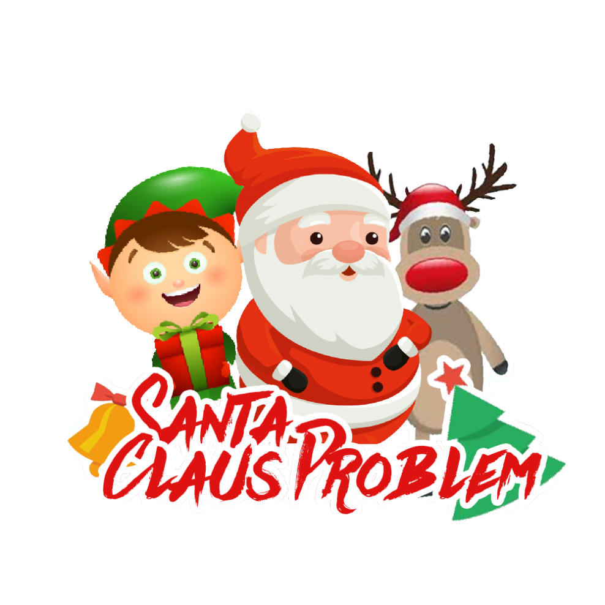

# Santa Claus Problem

     
    

## Grill Alexander NVS Projekt 2020
Auf Grund der aktuellen Lage (Covid-19) wurden wir Schüler der HTL Wr.Neustadt in das Home-Schooling geschickt. Deshalb konnten eine
schriftliche Arbeiten, wie auch die Praktische Arbeit in NVS, nicht stattfinden. Herr Professor Kolousek kam zum Entschluss, dass
dieses Projekt bzw. Aufgabenstellung die Leistungüberprüfung ersetzt. Diese Projekt hat auch sinnvollerweiße Einfluss auf die Beurteilung.

Das Projekt deckt folgende Themen ab: Threads, Processe, Synchronisation, Synchronisation Mechanismus, Parallel Programming, Bedingungssynchronisation

### Santa Claus Problem
In diesem Projekt geht es darum, dass Santa Claus umbedingt seinen Schlaf benötigt, jedoch wird er von seinen Elfen oder Renntieren benötigt.
Er möchte aber auch die Kinder glücklich machen, darum ist es wichtig, dass er hin und wieder aufsteht und seinen Mitmenschen hilft, weil 
ohne der Hilfe von Santa Claus können einige Arbeiten nicht vollendet werden. Der Sinn der Aufgabe liegt, darin, dass trotz des notwendigen Schlafes von
Santa, müssen die Geschenke rechtzeitig an die Kinder geliefert werden.
